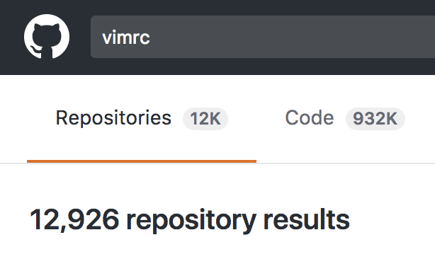
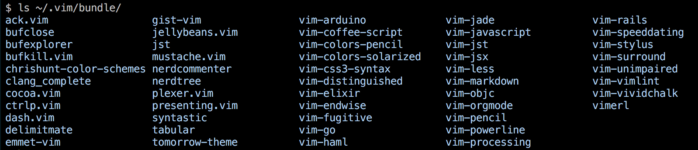

!SLIDE bullets incremental
# Extending vim

* macros (temporary)
* vimrc
* scripting
* plugins

!SLIDE normal
# Macro Demonstration

!SLIDE
# Number 1 Rule of Modifying Vim...

!SLIDE
# **SOMEONE HAS ALREADY DONE IT**

!SLIDE normal bullets

* [github.com](https://github.com/search?type=Repositories&language=vim&q=vimrc&repo=&langOverride=&x=0&y=27&start_value=1)

!SLIDE[bg=03_extension/vimrc-search-full.png] background-fit

!SLIDE center

!SLIDE bullets normal
# my vimrc

* [vimrc](https://github.com/abachman/dotfiles/blob/master/.vimrc)
* [gvimrc](https://github.com/abachman/dotfiles/blob/master/.gvimrc) (just for the GUI)

!SLIDE
# ignore scripting, it's not worth your time

!SLIDE normal
# some very handy plugins

First: **pathogen** or other plugin loader

Second: NERDTree, ctrlp, bufexplorer, rails.vim, Tabularize, closetag, fugitive, syntastic, vim-surround, etc.

!SLIDE full-image

