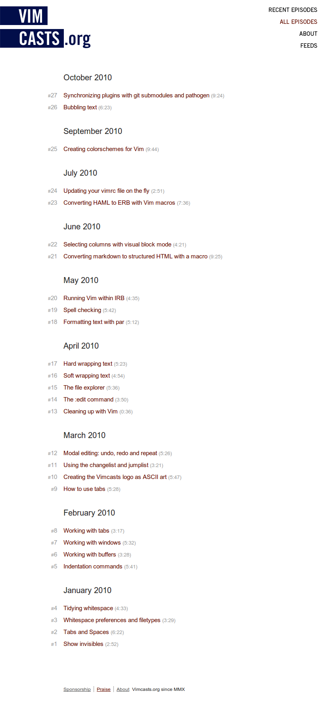

!SLIDE
# What's Next?
Keep using it.

!SLIDE
# What's Next?
Find reliable resources (like [vimcasts.org](http://vimcasts.org)). This stuff is pretty timeless.

!SLIDE

!SLIDE
# What's Next?

Ask questions, I'm happy to answer.

!SLIDE
# What's Next?

Have fun, this isn't punishment. If you find something that fits, use that.

!SLIDE
# What's Next?

Take it seriously, a maker should know their tools.

!SLIDE
# Go get 'em, sport
