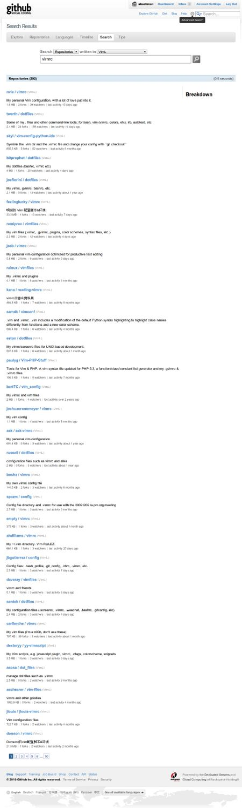

!SLIDE bullets incremental
# Extending vim

* macros (temporary)
* vimrc
* scripting
* plugins

!SLIDE normal
# Macro Demonstration

!SLIDE center
# Number 1 Rule of Modifying Vim...

!SLIDE center
# **SOMEONE HAS ALREADY DONE IT**

!SLIDE normal center bullets

* [github.com](https://github.com/search?type=Repositories&language=vim&q=vimrc&repo=&langOverride=&x=0&y=27&start_value=1)

!SLIDE full-page

!SLIDE center
# my vimrc

!SLIDE center
# ignore scripting, it's not worth your time

!SLIDE normal center
# some very handy plugins

NERDTree, Command-T, rails.vim, pathogen, Tabularize, closetag, zencoding, tim pope
